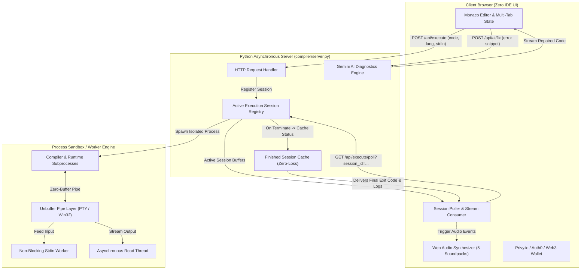

<div align="center">

```
  ███████╗███████╗██████╗  ██████╗      ██████╗ ██████╗ ███╗   ███╗██████╗ ██╗██╗     ███████╗██████╗ 
  ╚══███╔╝██╔════╝██╔══██╗██╔═══██╗    ██╔════╝██╔═══██╗████╗ ████║██╔══██╗██║██║     ██╔════╝██╔══██╗
    ███╔╝ █████╗  ██████╔╝██║   ██║    ██║     ██║   ██║██╔████╔██║██████╔╝██║██║     █████╗  ██████╔╝
   ███╔╝  ██╔══╝  ██╔══██╗██║   ██║    ██║     ██║   ██║██║╚██╔╝██║██╔═══╝ ██║██║     ██╔══╝  ██╔══██╗
  ███████╗███████╗██║  ██║╚██████╔╝    ╚██████╗╚██████╔╝██║ ╚═╝ ██║██║     ██║███████╗███████╗██║  ██║
  ╚══════╝╚══════╝╚═╝  ╚═╝ ╚═════╝      ╚═════╝ ╚═════╝ ╚═╝     ╚═╝╚═╝     ╚═╝╚══════╝╚══════╝╚═╝  ╚═╝
```

### Next-Gen Neo-Brutalist Cloud IDE, Polyglot Sandbox & AI Coding Engine

[](LICENSE)
[](https://www.python.org/)
[](Dockerfile)
[](https://microsoft.github.io/monaco-editor/)
[](#-5-mode-web-audio-synthesizer-soundpacks)
[](#-cloud-ai-copilot--1-click-auto-fix)
[](#-enterprise-identity--web3-authentication)

<p align="center">
  <a href="#-key-features"><b>Features</b></a> •
  <a href="#-architecture--execution-lifecycle"><b>Architecture</b></a> •
  <a href="#-supported-languages"><b>Languages</b></a> •
  <a href="#-5-mode-web-audio-synthesizer-soundpacks"><b>Soundpacks</b></a> •
  <a href="#-rest-api-documentation"><b>REST API</b></a> •
  <a href="#-quick-start"><b>Quick Start</b></a> •
  <a href="#-cloud-deployment"><b>Deployment</b></a>
</p>

---

</div>

## ⚡ Overview

**Zero Compiler** is a high-performance, containerized cloud IDE and real-time execution engine crafted with a bold **Neo-Brutalist / Arcade** aesthetic. Built around the Microsoft Monaco Editor engine, it pairs low-latency code compilation with non-blocking, unbuffered streaming I/O, a hardware-synthesized 5-theme audio engine, and deep Google Gemini AI copilot integration for 1-click crash diagnostics and auto-repair.

Whether running algorithmic C/C++ problems with interactive standard input, spinning up quick Python scripts, or compiling modern TypeScript/Go, Zero Compiler provides an instant, production-grade workstation directly inside the browser.

---

## ✨ Key Features

### 🖥️ 1. Monaco Editor (VS Code Powerhouse)
- **High-Fidelity IntelliSense**: Context-aware autocomplete snippets for standard library functions across C, C++, Python, JavaScript, Java, and Go.
- **Darryl Dual Themes**:
  - `darryl-cream` ⚡: Signature high-contrast light mode (warm eggshell canvas, cyber lime highlights, ink black typography).
  - `darryl-carbon` 🖤: Signature deep dark mode (carbon black base, neon lime accents, crisp monospaced code).
- **Interactive Multi-Tabs**: Create, switch, rename, close, and auto-detect file extensions with live language re-binding.
- **Productivity Toolkit**: Code minimap, word wrap toggle, instant document formatting (`Shift + Alt + F`), state persistence in `localStorage`, and base64 shareable quest URLs.

### ⚡ 2. Real-Time Interactive Streaming Execution
- **Zero-Latency Unbuffered Pipes**: Solves standard output buffering for interactive prompts (`printf("Enter two numbers: ")` displays immediately before user input).
- **Session-Based Polling & Interactive STDIN**: Send live terminal inputs sequentially to a running process, or feed batch inputs directly through the dedicated input console.
- **Process Isolation & Safety**: Subprocess execution with strict memory guardrails, execution timeouts, non-blocking asynchronous reading threads, and instant process termination.

### 🤖 3. Cloud AI Copilot & 1-Click Auto-Fix
- **Instant Crash Analysis**: One click inspects exit codes, compiler tracebacks, and runtime segfaults against your source code.
- **1-Click Auto-Fix & AST Rewrite**: Automatically generates verified, bug-free replacements that drop directly into your active Monaco model.
- **AI Assistant Chat & Duck Wizard**: Interactive debugger for time/space complexity audits, code documentation, algorithmic optimization, and conceptual explanations.
- **Offline Resilient**: Ships with intelligent rule-based local fallbacks when an external API key is not configured.

### 🔊 4. 5-Mode Web Audio Synthesizer Soundpacks
Built entirely on the native **Web Audio API** without external audio file dependencies. Every keystroke, execution, success, and error produces authentic analog synthesized wave patterns:

| Theme Profile | Sound Aesthetic | Waveform & Pitch Profile |
| :--- | :--- | :--- |
| 🕹️ **8-Bit Arcade** | Classic Coin-Op Arcade | Square blips, dual-tone triangle sweeps, ascending coin arpeggios (`C5 → E5 → G5 → C6`) |
| 🍄 **Nintendo NES** | Authentic 80s Chiptune | 988Hz B5 blips, 6-note Mario 1-Up powerup sweep, high E6 victory chime, pipe-thud misses |
| ⚡ **Cyberpunk Synth** | Neon Blade Runner Sci-Fi | Exponential laser frequency sweeps (1400Hz → 350Hz), warp drive sweeps, 4-note major triad pads |
| ⌨️ **Mechanical THOCK** | Custom Tactile Key Switches | 1800Hz snap + 140Hz deep housing thock, triple actuation cadence, typewriter carriage bell DING! |
| 🫧 **Modern Zen** | Clean UI & Kalimba Pop | Gentle waterdrop pops, ascending marimba runs, calming kalimba triad chords (`E5 → A5 → C#6`) |

> [!TIP]
> Use the **01 // AUDIO THEME** topbar dropdown menu or the IDE Settings modal to switch sound packs or toggle mute instantly.

### 🔐 5. Enterprise Identity & Web3 Authentication
- **Privy.io Passwordless Auth**: Seamless login via OTP email, Google OAuth, and GitHub OAuth.
- **Web3 Wallet Connect**: Native MetaMask / Ethereum wallet connector for decentralized identity.
- **Enterprise SSO**: Auth0 and Okta integration ready out of the box.
- **Cloud Snapshots**: Save, browse, restore, and export permanent timestamped code snapshots directly to your account.

---

## 🏗️ Architecture & Execution Lifecycle



---

## 🌐 Supported Languages

Zero Compiler bundles out-of-the-box support for the world's most popular systems, scripting, and enterprise languages:

| Language | Identifier | Toolchain / Compiler | Interactive Stdin | File Extension |
| :--- | :--- | :--- | :---: | :--- |
| **C** | `c` | `gcc (Ubuntu / MinGW-w64)` | ✅ Yes | `.c` |
| **C++** | `cpp` | `g++ -O2 -std=c++17` | ✅ Yes | `.cpp` |
| **Python** | `python` | `python3 -u (Unbuffered Binary)` | ✅ Yes | `.py` |
| **JavaScript** | `javascript` | `Node.js v18+` | ✅ Yes | `.js` |
| **TypeScript** | `typescript` | `ts-node / esbuild` | ✅ Yes | `.ts` |
| **Java** | `java` | `OpenJDK 21 (javac & java)` | ✅ Yes | `.java` |
| **Go** | `go` | `Go 1.21+ (go run)` | ✅ Yes | `.go` |
| **Rust** | `rust` | `rustc 1.70+` | ✅ Yes | `.rs` |
| **Ruby** | `ruby` | `Ruby 3.1+` | ✅ Yes | `.rb` |
| **PHP** | `php` | `PHP 8.2 CLI` | ✅ Yes | `.php` |

---

## 🔌 REST API Documentation

The backend exposes a lightweight, stateless JSON API suitable for embedding in external applications, bots, or educational platforms:

### 1. Execute Code
```http
POST /api/execute
Content-Type: application/json
```
```json
{
  "language": "c",
  "code": "#include <stdio.h>\nint main() { printf(\"Hello World!\\n\"); return 0; }",
  "stdin": ""
}
```
**Response (200 OK):**
```json
{
  "session_id": "8f3b9c71-24da-4a5f-b5ec-62a22be9b084",
  "status": "running"
}
```

### 2. Poll Execution Stream
```http
GET /api/execute/poll?session_id=8f3b9c71-24da-4a5f-b5ec-62a22be9b084
```
**Response (200 OK):**
```json
{
  "output": "Hello World!\n",
  "status": "completed",
  "exit_code": 0,
  "execution_time_ms": 42
}
```

### 3. Send Interactive Input (Stdin)
```http
POST /api/execute/input
Content-Type: application/json
```
```json
{
  "session_id": "8f3b9c71-24da-4a5f-b5ec-62a22be9b084",
  "input": "42\n"
}
```

### 4. Force Terminate Execution
```http
POST /api/execute/stop
Content-Type: application/json
```
```json
{
  "session_id": "8f3b9c71-24da-4a5f-b5ec-62a22be9b084"
}
```

### 5. 1-Click AI Auto-Fix
```http
POST /api/ai/fix
Content-Type: application/json
```
```json
{
  "language": "c",
  "code": "int main() { printf(x); }",
  "error": "error: 'x' undeclared"
}
```
**Response (200 OK):**
```json
{
  "fixed_code": "#include <stdio.h>\nint main() {\n    int x = 10;\n    printf(\"%d\\n\", x);\n    return 0;\n}",
  "explanation": "Declared integer variable 'x' and included stdio.h header."
}
```

---

## ⌨️ Keyboard Shortcuts Matrix

| Action | Shortcut | Function |
| :--- | :--- | :--- |
| **Run Code** | <kbd>Ctrl</kbd> + <kbd>Enter</kbd> | Compiles and executes code in the active editor tab |
| **Stop Process** | <kbd>Esc</kbd> | Terminate running execution and release audio locks |
| **Format Document** | <kbd>Shift</kbd> + <kbd>Alt</kbd> + <kbd>F</kbd> | Auto-indents and formats code based on language syntax |
| **Find in Code** | <kbd>Ctrl</kbd> + <kbd>F</kbd> | Open Monaco's advanced regex search widget |
| **Find & Replace** | <kbd>Ctrl</kbd> + <kbd>H</kbd> | Replace occurrences across the active file |
| **AI Assistant** | <kbd>Ctrl</kbd> + <kbd>I</kbd> | Open the interactive Cloud AI drawer |
| **Toggle Comment** | <kbd>Ctrl</kbd> + <kbd>/</kbd> | Toggle line/block comments |
| **New Module Tab** | <kbd>Ctrl</kbd> + <kbd>Alt</kbd> + <kbd>N</kbd> | Instantiate a new file tab with starter template |

---

## 🚀 Quick Start

### 1. Clone the Repository
```bash
git clone https://github.com/musculophillee/new-compiler.git
cd new-compiler
```

### 2. Local Environment Setup
Make sure you have **Python 3.8+** installed along with compilers for the languages you wish to execute (`gcc`, `g++`, `node`, `default-jdk`, `go`).

```bash
# Run server
python compiler/server.py

# Or on Windows:
py compiler/server.py
```

Open your browser and navigate to:
```
http://localhost:4000
```
- Interactive Code IDE: `http://localhost:4000/editor.html`
- Landing & Feature Showcase: `http://localhost:4000/index.html`

---

## 🐳 Docker Deployment

A multi-stage, battle-tested `Dockerfile` is included with Ubuntu 22.04, GCC, G++, Python 3, Node.js, OpenJDK 21, and Golang pre-installed:

```bash
# Build the Docker image
docker build -t zero-compiler .

# Run the containerized IDE on port 10000
docker run -p 10000:10000 zero-compiler
```
Visit `http://localhost:10000` to start coding.

---

## ☁️ Cloud Deployment Guides

### Option A: Render.com (1-Click Deployment)
This repository includes a native [`render.yaml`](render.yaml) specification:
1. Log in to [Render Dashboard](https://dashboard.render.com).
2. Click **New +** ➔ **Blueprint** (or **Web Service**).
3. Connect your GitHub repository `https://github.com/musculophillee/new-compiler`.
4. Render automatically builds the multi-compiler Docker environment and exposes port `10000`.
5. Your compiler is live on `https://your-app.onrender.com`!

### Option B: Fly.io
Deploy globally in seconds via the included [`fly.toml`](fly.toml):
```bash
# Install flyctl
powershell -Command "iwr https://fly.io/install.ps1 -useb | iex"   # Windows
# or: curl -L https://fly.io/install.sh | sh                       # macOS / Linux

# Launch and deploy
fly launch
fly deploy
```

---

## 📁 Repository Structure

```tree
new-compiler/
├── 🐳 Dockerfile               # Production multi-language compiler container
├── ⚙️ fly.toml                 # Fly.io global deployment configuration
├── 📄 render.yaml              # Render.com Infrastructure-as-Code Blueprint
├── 📄 vercel.json              # Vercel serverless / edge routing rules
├── 🛡️ .gitignore               # Comprehensive ignores for binaries, cache & keys
├── 📖 README.md                # Comprehensive documentation & architecture guide
│
├── 📂 compiler/                # Core Web IDE & Execution Engine
│   ├── 🌐 index.html           # Neo-Brutalist landing page & feature showcase
│   ├── 💻 editor.html          # Monaco IDE workspace, topbar & multi-pane UI
│   ├── ⚡ script.js            # Synthesizer, session poller, Monaco setup, AI
│   ├── 🎨 style.css            # Neo-Brutalist design tokens, themes & animations
│   ├── 🐍 server.py            # Async execution manager, unbuffered streaming server
│   ├── 🔐 auth_db.py           # SQLite authentication & token verification backend
│   ├── 🔑 auth0-spa-js...      # Auth0 enterprise identity bundle
│   └── 🖼️ assets/              # Icons, badges, and retro branding assets
│
└── 📂 portfolio/               # Developer portfolio showcase pages
```

---

## 👨‍💻 Author & Maintainer

<div align="center">

**RITIK SONI**  
*Full-Stack Engineer & Systems Architect*  

[](https://github.com/musculophillee)
[](mailto:hrithik.codes@gmail.com)

</div>

---

## 📄 License

This project is licensed under the **MIT License** — see the [LICENSE](LICENSE) file for full details. Free for educational, personal, and commercial software development.

<div align="center">
  <sub>Crafted with ⚡ and pixel precision for developers who demand both speed and style.</sub>
</div>
